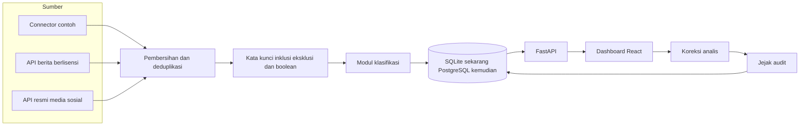

# Arsitektur

Dashboard ini memisahkan pengambilan data, penilaian, dan tampilan agar sumber sungguhan bisa dipasang tanpa mengubah layar.

## Lapisan

1. **Connector** (`backend/app/connectors`). Setiap sumber mengembalikan bentuk `RawItem` yang sama. Yang aktif sekarang hanya `MockFeedConnector`. Kerangka NewsAPI, GDELT, RSS, dan API sosial resmi sudah disiapkan dan sengaja belum menarik data.
2. **Pembersihan** (`services/pipeline.py`). Hash `platform + judul + akun` menolak duplikat. Teks yang memuat kata eksklusi, atau yang tidak lolos satu pun ekspresi boolean aktif, tidak disimpan.
3. **Klasifikasi** (`app/nlp`). MVP memakai leksikon bahasa Indonesia, termasuk gaul dan satu pola sarkasme. Fungsi `analyze()` adalah satu-satunya pintu. IndoBERT atau LLM cukup mengisi kamus hasil yang sama. Prompt ada di `app/nlp/prompts.py`.
4. **Skor** (`app/nlp/risk.py`). Risiko reputasi dan relevansi kebijakan dihitung dari bobot yang bisa diubah di layar Pengaturan.
5. **API** (`app/routers/api.py`). Semua halaman membaca endpoint yang sama, dengan filter tanggal, platform, dan kategori.
6. **UI** (`frontend/src`). Filter global menempel di setiap halaman. Grafik harian bisa dibuka ke Explorer.

## Alur penanganan

Status mention dan isu: Baru, Ditinjau, Dieskalasi, Ditangani, Selesai. Analis dan admin dapat mengubah label. Setiap perubahan label atau status masuk `audit_logs`. Pimpinan hanya melihat.

## Peran

| Peran | Melihat | Koreksi label dan status | Kata kunci, bobot, aturan, reset |
| --- | --- | --- | --- |
| Pimpinan | ya | tidak | tidak |
| Analis | ya | ya | tidak |
| Admin | ya | ya | ya |

## Asumsi

- Data pada MVP fiktif, dengan nama media sebagai label sumber. Tautan mengarah ke domain contoh, bukan artikel sungguhan.
- Jam disimpan sebagai WIB tanpa informasi zona.
- Jangkauan adalah estimasi, bukan metrik resmi platform.
- Peta Jakarta skematik berdasarkan kota administrasi yang ditandai, bukan peta GIS.
- Tanda "perlu diverifikasi" adalah indikasi pola unggahan, bukan kesimpulan bahwa akun adalah bot.
- Email, WhatsApp, dan Telegram dicatat sebagai kanal pada aturan, tetapi belum dikirim.
- Autentikasi demo memakai HMAC lokal. Produksi harus memakai identitas kantor dan penyimpanan sandi yang layak.
- Tidak ada scraping. Sumber produksi hanya lewat API resmi atau vendor berlisensi.
- Sistem tidak membuat profil individu di luar percakapan publik.
